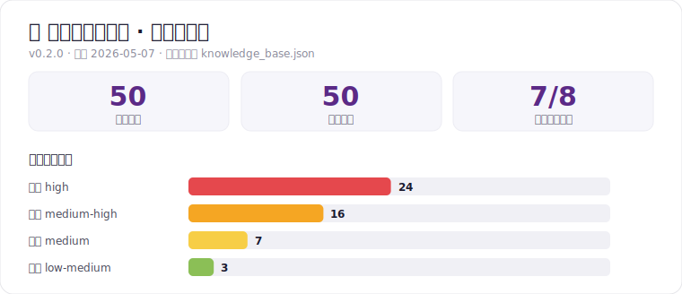
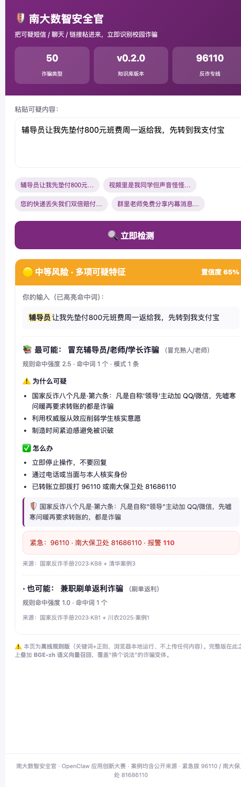

<div align="center">

# 🛡 南大数智安全官 NJU Guardian

**校园场景化反诈 AI Agent · 基于 OpenClaw 的开源原型**

[](LICENSE)
[](demo/knowledge_base.json)
[](demo/embedding_engine.py)
[](#-快速开始)
[](../../actions/workflows/ci.yml)

OpenClaw 应用创新大赛参赛项目 · 用「关键词 + 正则」 ⊕「BGE-zh 向量召回」识别校园电信诈骗

</div>

---

## 📌 这是什么

一个**专为大学生设计**的反诈智能助手原型。把可疑短信 / 聊天记录 / 链接粘进去，立即得到：

- 🔴🟡🟢 **三级风险评级** + 置信度
- 📐🧠 **双路命中信号**（规则强度 + 语义相似度）
- 📚 **匹配的诈骗案例**（含作案手法 / 反诈八个凡是 / 三步行动建议 / 公开来源）
- 📤 **可转发卡片**（一键发到班群提醒同学）
- 💾 **HTML 报告**（浏览器 ⌘+P 打印 PDF 留档）

针对的痛点：

- 国家反诈中心 App 偏通用，**校园场景命中率低**（冒充辅导员、奖助学金、保录留学、二手 iPhone…）
- 大学生不爱看图文宣传册，**喜欢"粘进去就出结果"**的工具
- 受骗后想提醒同学，找不到清晰可转发的格式

参赛项目公开摘要见 [docs/application_summary.md](docs/application_summary.md)。

## 📊 案例库一览

<div align="center">



</div>

> 此图由 [`tools/gen_stats_svg.py`](tools/gen_stats_svg.py) **从 `knowledge_base.json` 自动生成**——案例库扩充后重跑一次即更新。我们交付的不是一份静态案例集，而是一套带格式治理、可自动采集、**会自己长大**的反诈知识系统（采集→结构化→校验→去重→人工审核，见 [`ingest/`](ingest/)）。

## 📱 现场扫码体验（H5）

<table>
<tr>
<td width="42%" align="center">
<br>
<sub>扫码即用 · 手机浏览器打开</sub>
</td>
<td width="58%">

一个**纯前端、零服务器**的移动端 H5：把可疑短信/聊天粘进去，浏览器**本地**跑关键词+正则检测，立即给出风险卡片——**不上传任何输入内容**，现场不依赖网络连演示者电脑。

- 在线地址：`https://hjjbh1314.github.io/nju-guardian/`（启用 Pages 后生效）
- 本地体验：直接双击 [`web/index.html`](web/index.html)
- 检测逻辑与 Python 版规则路**一致**（实测 12/12 命中对齐）
- 数据由 [`tools/build_web.py`](tools/build_web.py) 从知识库编译，**单一真相源**

> 这一步回应评委建议：可做成 H5 / 小程序 / 接入校园 App，让同学随手就能查。当前为 H5，小程序为后续路线。

</td>
</tr>
</table>

<div align="center">
<br>
<sub>检测结果卡片：风险评级 + 命中高亮 + 为什么可疑 + 三步建议 + 八个凡是 + 公开来源</sub>
</div>

## 📈 检测效果（量化）

在 30 条**口语化**校园诈骗样本（[`demo/tests/eval_set.json`](demo/tests/eval_set.json)）上实测：

| 模式 | Top-1 准确率 | Top-3 召回率 |
|---|---:|---:|
| 规则路（关键词+正则） | 70% | 80% |
| **双路融合（+ BGE-zh 向量）** | **87%** | **100%** |

向量召回补回了规则路漏掉的 6 条"语义变体"（换个说法的杀猪盘 / AI 换脸 / 二次清退…）——这正是做双路融合而非只堆关键词的原因。复现：`python demo/tests/eval.py [--vector]`，详见 [docs/eval_results.md](docs/eval_results.md)。

## 🖼 演示

> 完整流程见 [demo/录屏脚本_30s.md](demo/录屏脚本_30s.md)。在 [`visuals/`](visuals/) 目录里有静态 mockup（HTML 直接打开）。

```
┌──────────────────────────────────────────────────────────┐
│ 🛡 南大数智安全官 · NJU Guardian       [v0.2.1·KB 50·双路召回] │
├──────────────────────────────────────────────────────────┤
│ 输入: 微信视频里看见同学但是声音怪怪的让我转 2000 块说手机被偷了│
│                                                          │
│ ● 中等风险 · 语义疑似（建议进一步核实）       置信度 70%   │
│                                                          │
│ 📚 命中案例 · KB-016 · AI 换脸/拟声视频通话诈骗            │
│   📐 规则 1.0  🧠 语义 0.63  · 综合分 2.6                  │
│                                                          │
│ 🛡 国家反诈八个凡是·命中条目                              │
│   第 6 条 · 凡是自称"领导"主动加 QQ/微信，先嘘寒问暖再...  │
│                                                          │
│ 📌 三步行动建议                                          │
│   1. 任何转账请求都通过电话二次核实，由你拨过去            │
│   2. 与家人约定专属暗号，视频时让对方做转头/挥手动作       │
│   3. 已转账立即冻结账户、银行止付，并拨打 96110           │
└──────────────────────────────────────────────────────────┘
```

## ✨ 特性

### 双路召回检测引擎

```
用户输入 ─┬─→ 规则路：keyword + regex 命中 → rule_score
         └─→ 向量路：BGE-zh 语义相似度    → vector_sim
                          ↓
                综合分 = rule_score + 2.5 × vector_sim
                          ↓
        高风险（双路确认）→ 中等（单路强信号）→ 低风险
```

| 维度 | 实现 |
|---|---|
| 规则路 | 50 case × keywords[] + patterns[] |
| 向量模型 | [BAAI/bge-small-zh-v1.5](https://huggingface.co/BAAI/bge-small-zh-v1.5)（95MB，中文优化）|
| 降级策略 | SBERT → TF-IDF → 仅规则 |
| 嵌入缓存 | 首次 5-15s 构建后存盘，二次启动毫秒级 |
| 单次延迟 | ~180ms（CPU）|

### 50 类知识库（v0.2.0）

每条 case 强制带 `source` 字段，引用国家反诈中心 / 公安部刑侦局 / 央视 / 新华社等**公开材料**；来源短标说明见 [docs/sources.md](docs/sources.md)。覆盖：

- **国家反诈十大类**：刷单返利 · 投资理财 · 网贷 · 电商客服 · 公检法 · 注销校园贷 · 虚假购物 · 冒充熟人 · 网游交易 · 婚恋杀猪盘
- **新型 2024-2025**：AI 换脸/拟声 · 共享屏幕远控 · 币圈/元宇宙 · 二次诈骗"清退维权" · 假冒反诈 App
- **校园特化 12 类**：冒充辅导员 · 奖助学金 ATM 激活 · 论文代写 · 留学保录 · 付费内推 · 兼职打字员 · 二手 iPhone · 教务系统钓鱼 · 火车票退改 · 校外租房 · 抑郁咨询陷阱 · 抢红包外挂

完整列表见 [demo/knowledge_base.json](demo/knowledge_base.json)。

### 数据与隐私

- **本地优先**：默认本地 Gradio + 本地嵌入；不联网也能跑（首次需下模型）
- **无持久化**：原型阶段不存储用户输入；决赛 OpenClaw 版会专门做 PII 脱敏 Workflow
- **可选 LLM 增强**：用户自带 API Key，按 OpenAI 兼容协议调（DeepSeek / 通义百炼 / Moonshot 都行）

## 🚀 快速开始

```bash
git clone https://github.com/hjjbh1314/nju-guardian.git
cd nju-guardian/demo

python3 -m venv .venv
source .venv/bin/activate          # Windows: .venv\Scripts\activate
pip install -r requirements.txt

python nju_guardian.py
# → http://127.0.0.1:7860
```

首次启动会下载 [bge-small-zh-v1.5](https://huggingface.co/BAAI/bge-small-zh-v1.5) 模型（~95MB，仅一次）。模型下载失败会自动降级到 TF-IDF。

### OCR（可选）

只用「文本检测 / 链接核验」**不需要装 OCR**。要用「截图识别」才需要：

```bash
brew install tesseract tesseract-lang   # macOS
# Ubuntu: sudo apt install tesseract-ocr tesseract-ocr-chi-sim
```

### 🧪 跑测试

```bash
python demo/tests/test_smoke.py
# → 4/4 通过：KB schema · 规则路 12/12 · 八个凡是覆盖 · 紧急电话齐全
```

## 🗺 路线图

| 阶段 | 状态 | 说明 |
|---|:-:|---|
| v0.1 · MVP | ✅ | Gradio + 关键词匹配 + 15 类 KB |
| v0.2 · 对话卡片输出 | ✅ | 风险横条 / 关键词高亮 / 八个凡是引用 |
| **v0.2.1 · 双路召回 + 50 类 KB** | ✅ | **当前版本**（2026-05-07）|
| v0.3 · 真实校园场景回流 | 📌 | 与南大保卫处合作（决赛后启动）|
| v1.0 · OpenClaw 决赛版 | 📌 | RAG + 多 Agent 协作 + 微信小程序 |

## 🤝 贡献

新增诈骗案例、改进引擎、完善文档、修 bug 都欢迎 —— 详见 [CONTRIBUTING.md](CONTRIBUTING.md)。

**核心规则**：所有进入仓库的 case 必须能给出**公开来源 URL、正式出版物名称或可核验的公开来源标注**。详见贡献指南。

## 📜 许可证

- 代码：[MIT](LICENSE)
- 知识库 (`demo/knowledge_base.json`) 与视觉素材 (`visuals/`)：[CC BY 4.0](LICENSE-KB.md)

引用本项目请包含：

```
NJU Guardian: 校园场景化反诈 AI Agent (v0.2.1)
作者 · 南京大学 · 2026
https://github.com/hjjbh1314/nju-guardian
```

## 🙏 致谢

- 国家反诈中心《防范电信网络诈骗宣传手册（2023版）》
- 公安部刑侦局公开预警通报
- 12381 涉诈预警系统
- 清华大学保卫部、四川农业大学保卫处、南京大学保卫处的公开反诈案例
- OpenClaw 平台与南京大学计算机学院的赛事支持

## 📞 紧急联系

如果你或身边的同学正在遭遇可疑情况，**先停下来**，再做下面任何一件事：

- **96110** · 反诈劝阻专线
- **南大保卫处 81686110** · 校内紧急
- **12381** · 涉诈短信预警举报
- **110** · 报警

本项目工具不替代官方渠道。

---

<div align="center">
<sub>Made with ☕ by 作者 · 南京大学经济学（拔尖计划）· OpenClaw 应用创新大赛参赛 Demo</sub>
</div>
